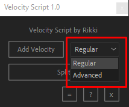

# Velocity Script

After Effects script that allows you to animate time-remapping using speed slider.

## Installation

1. Download the `Velocity_Script.jsx` script.
2. Move the file to:
   - Windows: `C:\Program Files\Adobe\Adobe After Effects <version>\Support Files\Scripts\ScriptUI Panels`
   - macOS: `/Applications/Adobe After Effects <version>/Scripts/ScriptUI Panels`
3. Restart After Effects.

## Usage

1. Open After Effects.
2. Go to `Window`, scroll all the way down and open `Velocity_Script.jsx`.
3. The Velocity Script panel will open. It's dockable.

### Buttons
- **Add Velocity**: Adds velocity.
- - **Regular**: default time-remapping.
- - **Advanced**: time-remapping with a speed slider.

- **Split**: Splits the layer and removes useless velocity keyframes.
- **=**: Opens the 'minimal speed' calculator.
- **?**: Shows some information.
- **x**: Removes the velocity.

## Links

Author: https://youtube.com/@shy_rikki  
Useful stuff: http://motionscript.com/articles/speed-control.html  

## Support

If you have any questions or found a bug, please create an issue in this repository or dm me in discord: `shy_rikki`